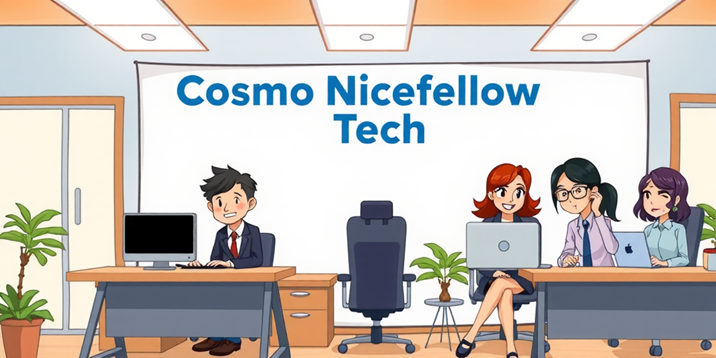

# Cosmo Nicefellow Tech

Cosmo Nicefellow Tech is an innovative agent system that simulates a software development company. Inspired by the concept of multi-agent collaboration, our system brings together various AI agents to create a virtual software development environment.



## 🌟 Overview

Cosmo Nicefellow Tech leverages the power of large language models (LLMs) to create a collaborative, AI-driven software development process. Our system is designed to be:

- **Easy to use**: Simple setup and intuitive interface
- **Highly customizable**: Adapt the system to your specific needs
- **Extendable**: Build upon and enhance the core functionality

## 🤖 Key Features

- **Multi-Agent Collaboration**: Various AI agents work together, each with a specific role in the software development process.
- **Natural Language Input**: Describe your software idea in plain language, and watch as our agents bring it to life.
- **Simulated Development Lifecycle**: Experience a complete software development cycle, from ideation to testing.

## 🚀 Getting Started

1. Clone the repository:
   ```
   git clone https://github.com/MeNicefellow/CosmoNicefellowTech
   ```
2. Install dependencies:
   ```
   pip install -r requirements.txt
   ```
3. Set up your API key:

   Put your OpenAI API key in a file called .openai_api_key in your home directory.

4. Run the main script:
   ```
   python main.py --project "Your project description"
   ```

5. To run the Streamlit based web UI:
   ```
   streamlit run main_webui.py
   ```

6. The product will be written in the workspace directory.

   **Note**: The workspace directory will contain both the generated project files and some example projects created by the system. You can explore these examples to see how Cosmo Nicefellow Tech works with different project types.

## 📸 Web UI Screenshot


## 🛠️ System Components

- **CEO**: Oversees the project and makes high-level decisions
- **CPO**: Manages product design and user experience
- **System Designer**: Manages product design and user experience
- **Programmer**: Writes and implements code
- **Code Reviewer**: Ensures code quality and best practices

## 🔧 Customization

Cosmo Nicefellow Tech is designed to be highly customizable. You can modify agent roles, adjust the development process, or integrate new features to suit your specific needs.


## 🙏 Acknowledgments

- Inspired by the [ChatDev project](https://github.com/OpenBMB/ChatDev) [^1]
- Built with the power of large language models


## Security Considerations

- The system executes Python code and shell commands. Ensure proper security measures are in place when deploying in a production environment.
- Implement additional validation and sanitization for user inputs and LLM outputs to prevent potential security risks.


## Disclaimer

This software is provided "as is", without warranty of any kind, express or implied, including but not limited to the warranties of merchantability, fitness for a particular purpose and noninfringement. In no event shall the authors or copyright holders be liable for any claim, damages or other liability, whether in an action of contract, tort or otherwise, arising from, out of or in connection with the software or the use or other dealings in the software.

Users are responsible for checking and validating the correctness of their configuration files, safetensor files, and binary files generated using the software. The developers assume no responsibility for any errors, omissions, or other issues coming in these files, or any consequences resulting from the use of these files.


## License

[Apache 2.0](https://github.com/MeNicefellow/CosmoNicefellowTech/LICENSE)

## Discord Server

Join our Discord server [here](https://discord.gg/xhcBDEM3).

## Feeling Generous? ߘ

Eager to buy me a cup of 2$ coffe or iced tea?ߍ☕ Sure, here is the link: [https://ko-fi.com/drnicefellow](https://ko-fi.com/drnicefellow). Please add a note on which one you want me to drink?
[^1]: https://github.com/OpenBMB/ChatDev
